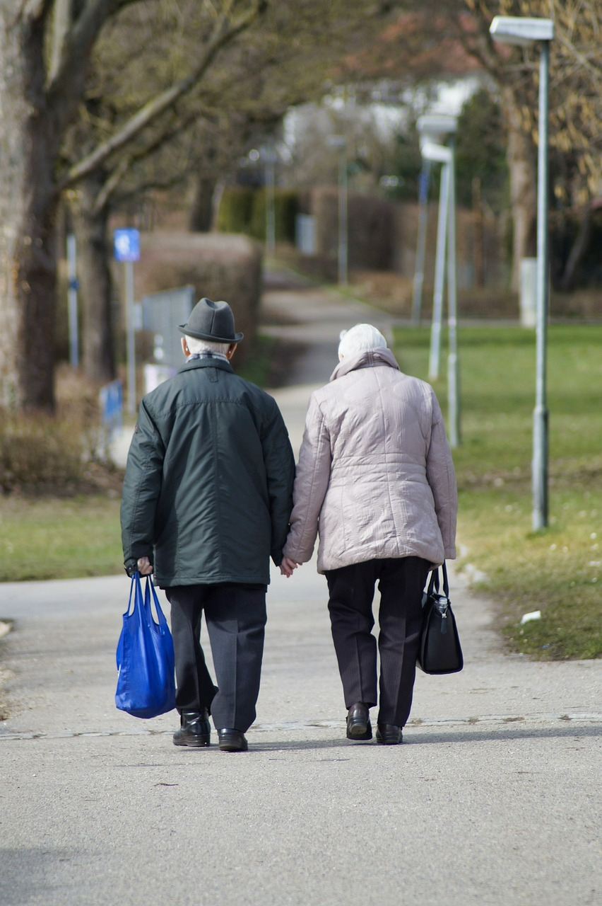
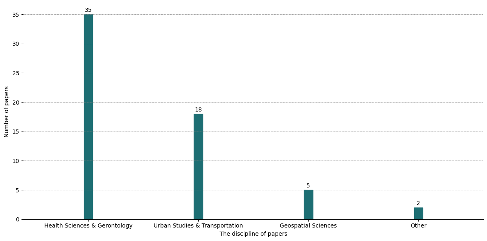
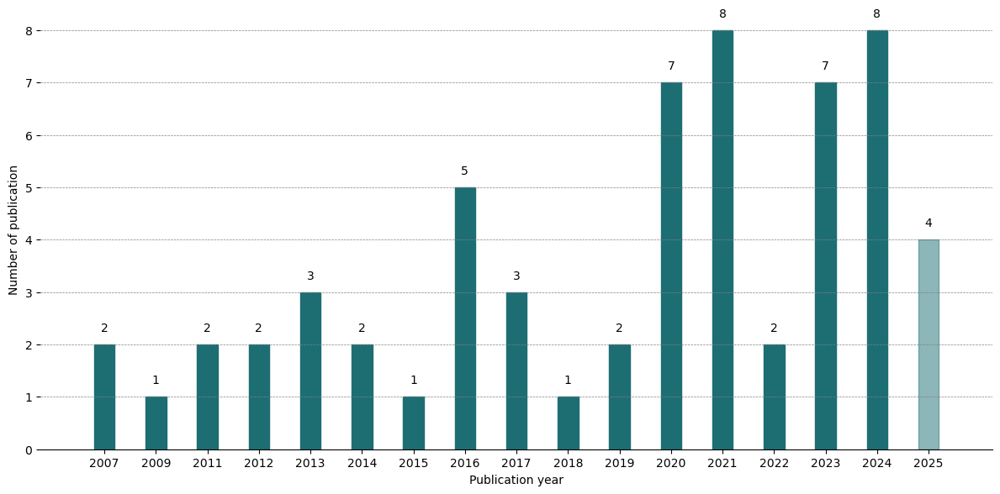
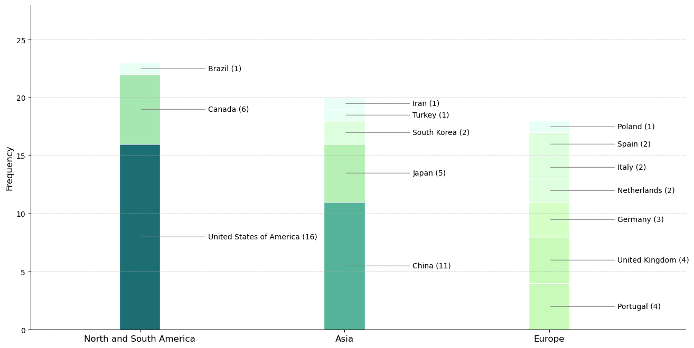
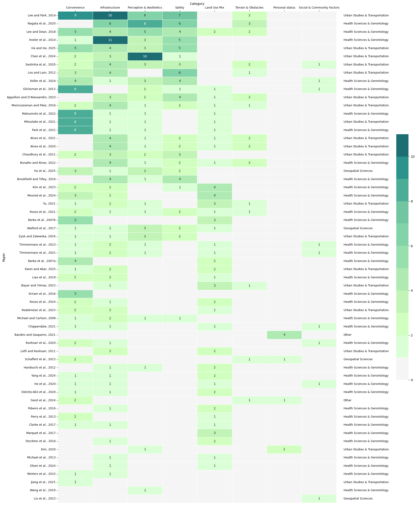
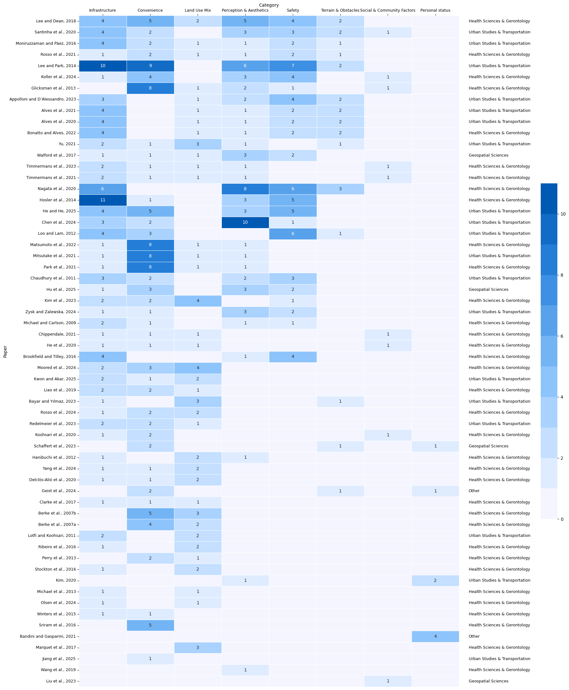

```{r xaringan-all,include=FALSE, echo=FALSE}
library(countdown)
library(xaringan)
library(xaringanExtra)
library(knitr)
library(xaringanthemer)

hook_source <- knitr::knit_hooks$get('source')
knitr::knit_hooks$set(source = function(x, options) {
  x <- stringr::str_replace(x, "^[[:blank:]]?([^*].+?)[[:blank:]]*#<<[[:blank:]]*$", "*\\1")
  hook_source(x, options)
})

xaringanExtra::use_broadcast()
xaringanExtra::use_freezeframe()
xaringanExtra::use_scribble()
#xaringanExtra::use_slide_tone()
xaringanExtra::use_search(show_icon = TRUE, auto_search	=FALSE)
xaringanExtra::use_freezeframe()
xaringanExtra::use_clipboard()
xaringanExtra::use_tile_view()
xaringanExtra::use_panelset()
xaringanExtra::use_editable(expires = 1)
xaringanExtra::use_fit_screen()
xaringanExtra::use_extra_styles(
  hover_code_line = TRUE,         
  mute_unhighlighted_code = TRUE  
)

```

class: center, middle
## Beyond words: Analysing the relationship between built environment and walking behaviour of elderly people using multimodal AI

[Zirui Guo](https://github.com/Gzrayyy)

**Supervisor**  
[Dr Mengdie Zhuang](https://www.sheffield.ac.uk/ijc/people/mengdie-zhuang) &
[Dr Suvodeep Mazumdar](https://www.sheffield.ac.uk/ijc/people/suvodeep-mazumdar) 

`r Sys.Date()`

---
```{r setup, include=FALSE}
options(htmltools.dir.version = FALSE)
knitr::opts_chunk$set(
  fig.width=9, fig.height=3.5, fig.retina=3,
  out.width = "100%",
  cache = FALSE,
  echo = TRUE,
  message = FALSE, 
  warning = FALSE,
  hiline = TRUE
)
```


```{r logo-global, echo=FALSE, results='asis'}
cat('
<script>
  window.addEventListener("DOMContentLoaded", function () {
    const slides = document.querySelectorAll(".remark-slide-content");

    slides.forEach(slide => {
      const logoWrapper = document.createElement("div");
      logoWrapper.className = "slide-logo";
      const img = document.createElement("img");
      img.src = "img/Primary logo.png";
      img.alt = "Logo";
      logoWrapper.appendChild(img);
      slide.appendChild(logoWrapper);
    });
  });
</script>

<style>
.slide-logo {
  position: absolute;
  top: 0em;
  right: 0em;
  width: 250px;
  z-index: 99;
}
.slide-logo img {
  width: 100%;
  height: auto;
}

/* 自动隐藏 inverse 页面上的 logo */
.remark-slide-content.inverse .slide-logo {
  display: none;
}
</style>
')
```


```{r xaringan-themer, include=FALSE, warning=FALSE}
library(xaringanthemer)
style_duo_accent(
  primary_color = "#1381B0",
  secondary_color = "#FF961C",
  inverse_header_color = "#FFFFFF"
)
```

```{r, load_refs, include=FALSE, cache=FALSE}
library(RefManageR)
BibOptions(check.entries = FALSE,
           bib.style = "authoryear",
           cite.style = "authoryear", 
           style = "markdown",
           hyperlink = TRUE,
           dashed = FALSE,
           max.names = 2,
           longnamesfirst = FALSE,
           no.print.fields=c("doi", "url", "urldate", "issn"))
myBib <- ReadBib("./mybib.bib", check = FALSE)
```

## Background
### Global aging challenge

According to `r Citet(myBib, 'unitednations_world_2025')`, the global population
aged 65 and above reached 771 million, nearly 10% of the world’s total, and is projected
to double the number of children under 5 and nearly equal those under 12 by 2050. In
England and Wales, this population grew by 20% between the 2011 and 2021 censuses, from
9.2 to 11 million `r Citep(myBib, 'officefornationalstatistics_profile_2023')`.

.pull-left[
```{r echo=FALSE, out.width='100%',fig.align='center'}
knitr::include_graphics('img/worldpop.png')
```
.small[Source: United Nation]]
---
## Background
### Elderly people and walking

These demographic shifts highlight the importance of encouraging elderly people to walk, 
which enhances life expectancy, health.
Moreover, evidence shows that the willingness to walk among
elderly people was significantly associated with the physical characteristics of streets `r Citep(myBib, 'joseph_where_2007')`, underscoring the need to study the built environment to encourage elderly people to walk.

In recent years, a great deal of research has been done on walkability, which is a key
metric for evaluating the built environment. Despite walkability is widely used, its measurement and the datasets vary widely.
---
## Background

---
## Literature Review
### The innovation of walkability

.pull-left[
"And third, the sidewalk must have users on it fairly continuously, both to add to the number of effective eyes on the street and to induce the people in buildings along the street to watch the sidewalks in sufficient numbers. Nobody enjoys sitting on a stoop or looking out a window at an empty street. Almost nobody does such a thing. Large numbers of people entertain themselves, off and on, by watching street activity." `r Citet (myBib, 'jacobs_death_1961')`
]


.pull-right[
```{r echo=FALSE, out.width='100%', fig.align='center'}
knitr::include_graphics('img/Jane_Jacobs.jpg')
```

.small[Jane Jacobs. Source: [Wikipedia](https://en.wikipedia.org/wiki/Jane_Jacobs)]
]

.footnote[*The Death and Life of Great American Cities*]

---

## Literature Review

### The innovation of walkability
- `r Citet (myBib, "gehl_life_1987")`proposed tripartite criteria of protection, comfort, and enjoyment, emphasising perception and spatial details in the walking experience.

- `r Citet (myBib, "appleyard_livable_1980")` proposed the concept of ‘liveable streets’ via empirical research, highlighting the impact of transportation on the quality of community life.

- `r Citet (myBib, "frank_impacts_1994")` was the first to empirically quantify the impact of land use mix and density on walking, laying the methodological groundwork for subsequent efforts to develop standardised metrics for assessing pedestrian-friendly environments.

- `r Citet (myBib, "cervero_travel_1997")` proposed a "3D" model (Density, Diversity, Design) to systematically frame the relationship between built environment and walking behaviour.

---
## Literature Review

### Built Environment-focused Definitions

- The attribute of the built environment which can promote more walking or physical activity across different sizes of urban areas 
`r Citep (myBib, "westenhofer_walkability_2023", .opts = list(max.names = 1))`

### Perception-based Definitions
- Visual enclosure, facade complexity, and human scale `r Citep (myBib, "jaskiewicz_pedestrian_2000")`

### Operational / Framework-based Definitions (used to measure walkability)
- 3D framework: Density, Diversity, Design `r Citep (myBib, "cervero_travel_1997")`
- 5D framework: Density, Diversity, Design, Destination Accessibility, and Distance to Transit `r Citep (myBib, "ewing_travel_2010")`

---
## Literature Review

### Walking for elderly people

.pull-left[
- Low-risk
- Sociable
- Reduce the risk of chronic diseases
- Alleviate elderly people’s negative emotions
]

.pull-right[
```{r echo=FALSE, out.width='75%', fig.align='center'}

```

.small[Source: [NHS](https://www.birminghamsolihull.icb.nhs.uk/news-and-events/news/recognition-awards-birmingham-and-solihull-initiatives-driving-improvements-culture-and-quality-across-nhs)]
]
---
## Literature Review

### Current systematic literature review on walkability
Despite the well-documented benefits of walking for older adults, few systematic reviews have specifically focused on this demographic. `r Citet (myBib, "edwards_examining_2018")` examined walking behaviours in elderly people but focused primarily on stair use rather than broader outdoor built environment features. 
`r Citet (myBib, "akinci_how_2022")`, on the other hand, compared how walkability has been measured for elderly people versus the general population but did not centre their review on elderly people themselves. 

Thus, there is a need for a systematic literature review on elderly people.

---
## Literature Review

### Walkability measurement
- On-site field study
  - Interview and questionnaire
  - Field audit
  
- GIS data based
  - POI, Land use, Street connectivity
  
- SVI
  - Visual audit
  - AI and Computer version
---
class: inverse middle

.center[
# Research questions
]

--
- What is the current state of research on walkability for elderly people?
- How do different walkability index models perform in capturing elderly-specific needs, and which is the most suitable for this group under various scenarios?
- How can the inclusion of dynamic contextual features improve walkability assessment for older adults, and what are the spatial patterns and key contributors of elderly walkability in Sheffield?

---
## Methodology

<iframe width="768" height="432" src="https://miro.com/app/live-embed/uXjVIPrqKFc=/?embedMode=view_only_without_ui&moveToViewport=-24505,-6021,15946,10181&embedId=618613882657" frameborder="0" scrolling="no" allow="fullscreen; clipboard-read; clipboard-write" allowfullscreen></iframe>

---
## Result
### Disciplines distribution
```{r echo=FALSE, out.width='100%', fig.align='center'}

```


---
## Result
### Annual publication of included papers
```{r echo=FALSE, out.width='100%', fig.align='center'}

```

---
## Result
### Annual publication of included papers
```{r echo=FALSE, out.width='100%', fig.align='center'}

```

---
## Result
### Heatmap of walkability features

.pull-left[

```{r echo=FALSE, out.width='90%', fig.align='center'}

```
.small[Heatmap of studies sorted by the number of walkability features used]
]

.pull-right[

```{r echo=FALSE, out.width='90%', fig.align='center'}

```
.small[Heatmap of studies sorted by the number of walkability subcategories used]
]

---
## Result
### Features and subcategories for measuring walkability
<div style="transform: scale(0.35);
            transform-origin: top left;
            width: 1600px; 
            height: 1200px;
            overflow: hidden;
            margin: 0 auto;">
  
  <iframe src="img/sunburst_plot.html"
          width="1600"
          height="1200"
          frameborder="0"
          style="border: 1px solid #ccc; border-radius: 6px;">
  </iframe>
</div>
---
## Conclusion


---

## Reference

```{r results='asis', echo=FALSE}
PrintBibliography(myBib, start = 1, end = 6)
```

---
## Reference

```{r results='asis', echo=FALSE}
PrintBibliography(myBib, start = 7, end = 13)
```

---
class: center, middle

# Thanks!


