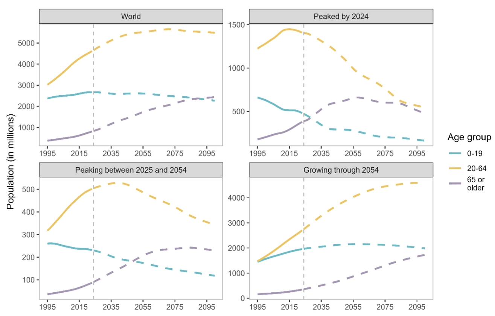
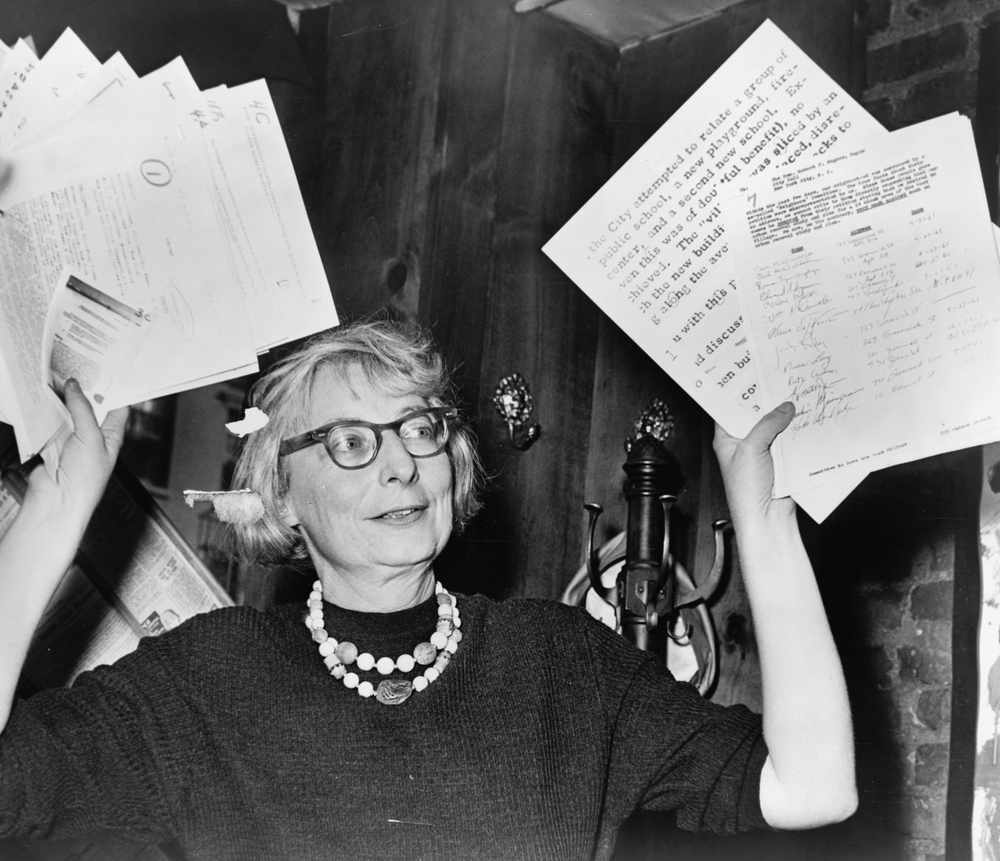

```{r xaringan-all,include=FALSE, echo=FALSE}
library(countdown)
library(xaringan)
library(xaringanExtra)
library(knitr)
library(xaringanthemer)

hook_source <- knitr::knit_hooks$get('source')
knitr::knit_hooks$set(source = function(x, options) {
  x <- stringr::str_replace(x, "^[[:blank:]]?([^*].+?)[[:blank:]]*#<<[[:blank:]]*$", "*\\1")
  hook_source(x, options)
})

xaringanExtra::use_broadcast()
xaringanExtra::use_freezeframe()
xaringanExtra::use_scribble()
#xaringanExtra::use_slide_tone()
xaringanExtra::use_search(show_icon = TRUE, auto_search	=FALSE)
xaringanExtra::use_freezeframe()
xaringanExtra::use_clipboard()
xaringanExtra::use_tile_view()
xaringanExtra::use_panelset()
xaringanExtra::use_editable(expires = 1)
xaringanExtra::use_fit_screen()
xaringanExtra::use_extra_styles(
  hover_code_line = TRUE,         
  mute_unhighlighted_code = TRUE  
)

```

class: center, middle
## Beyond words: Analysing the relationship between built environment and walking behaviour of elderly people using multimodal AI

[Zirui Guo](https://github.com/Gzrayyy)

**Supervisor**  
[Dr Mengdie Zhuang](https://www.sheffield.ac.uk/ijc/people/mengdie-zhuang) &  
[Dr Suvodeep Mazumdar](https://www.sheffield.ac.uk/ijc/people/suvodeep-mazumdar) 

`r Sys.Date()`

---
```{r setup, include=FALSE}
options(htmltools.dir.version = FALSE)
knitr::opts_chunk$set(
  fig.width=9, fig.height=3.5, fig.retina=3,
  out.width = "100%",
  cache = FALSE,
  echo = TRUE,
  message = FALSE, 
  warning = FALSE,
  hiline = TRUE
)
```


```{r logo-global, echo=FALSE, results='asis'}
cat('
<script>
  window.addEventListener("DOMContentLoaded", function () {
    const slides = document.querySelectorAll(".remark-slide-content");

    slides.forEach(slide => {
      const logoWrapper = document.createElement("div");
      logoWrapper.className = "slide-logo";
      const img = document.createElement("img");
      img.src = "img/Primary logo.png";
      img.alt = "Logo";
      logoWrapper.appendChild(img);
      slide.appendChild(logoWrapper);
    });
  });
</script>

<style>
.slide-logo {
  position: absolute;
  top: 0em;
  right: 0em;
  width: 250px;
  z-index: 99;
}
.slide-logo img {
  width: 100%;
  height: auto;
}

/* 自动隐藏 inverse 页面上的 logo */
.remark-slide-content.inverse .slide-logo {
  display: none;
}
</style>
')
```


```{r xaringan-themer, include=FALSE, warning=FALSE}
library(xaringanthemer)
style_duo_accent(
  primary_color = "#1381B0",
  secondary_color = "#FF961C",
  inverse_header_color = "#FFFFFF"
)
```

```{r, load_refs, include=FALSE, cache=FALSE}
library(RefManageR)
BibOptions(check.entries = FALSE,
           bib.style = "authoryear",
           cite.style = "authoryear",
           style = "markdown",
           hyperlink = TRUE,
           dashed = FALSE,
           no.print.fields=c("doi", "url", "urldate", "issn"))
myBib <- ReadBib("./mybib.bib", check = FALSE)
```

## Background
### Global aging challenge

According to `r Citet(myBib, 'unitednations_world_2025')`, the global population
aged 65 and above reached 771 million, nearly 10% of the world’s total, and is projected
to double the number of children under 5 and nearly equal those under 12 by 2050. In
England and Wales, this population grew by 20% between the 2011 and 2021 censuses, from
9.2 to 11 million `r Citep(myBib, 'officefornationalstatistics_profile_2023')`.

.pull-left[
```{r echo=FALSE, out.width='100%',fig.align='center'}

```
.small[Source: United Nation]]

---
## Background
.right-column[
These demographic shifts highlight the importance of encouraging elderly people to walk, 
which enhances life expectancy, health.These demographic shifts highlight the importance of encouraging elderly people to walk, 
which enhances life expectancy, health.These demographic shifts highlight the importance of encouraging elderly people to walk, 
which enhances life expectancy, health.These demographic shifts highlight the importance of encouraging elderly people to walk, 
which enhances life expectancy, health.These demographic shifts highlight the importance of encouraging elderly people to walk, 
which enhances life expectancy, health.These demographic shifts highlight the importance of encouraging elderly people to walk, 
which enhances life expectancy, health.
]
---
## Background

.left-column[
Text color

[Link Color](#3)

**Bold Color**

_Italic Color_

`Inline Code`
]

.right-column[
Lorem ipsum dolor sit amet, [consectetur adipiscing elit (link)](#3), 
sed do eiusmod tempor incididunt ut labore et dolore magna aliqua. 
Erat nam at lectus urna.
Pellentesque elit ullamcorper **dignissim cras tincidunt (bold)** lobortis feugiat. 
_Eros donec ac odio tempor_ orci dapibus ultrices. 
Id porta nibh venenatis cras sed felis eget velit aliquet.
Aliquam id diam maecenas ultricies mi.
Enim sit amet 
`code_color("inline")`
venenatis urna cursus eget nunc scelerisque viverra.
]

---

## Literature
### The innovation of walkability

.pull-left[
"And third, the sidewalk must have users on it fairly continuously, both to add to the number of effective eyes on the street and to induce the people in buildings along the street to watch the sidewalks in sufficient numbers. Nobody enjoys sitting on a stoop or looking out a window at an empty street. Almost nobody does such a thing. Large numbers of people entertain themselves, off and on, by watching street activity."
`r Citet (myBib, 'jacobs_death_1961')`
]


.pull-right[
```{r echo=FALSE, out.width='100%', fig.align='center'}

```

.small[Jane Jacobs. Source: [Wikipedia](https://en.wikipedia.org/wiki/Jane_Jacobs)]
]

---

## Literature
### The innovation of walkability


---
.left-column[
## First

## Second

## Third
]

.right-column[
Dolor quis aptent mus a dictum ultricies egestas.

Amet egestas neque tempor fermentum proin massa!

Dolor elementum fermentum pharetra lectus arcu pulvinar.
]

---
class: inverse middle

.center[
# Research questions
]

--
- What is the current state of research on walkability for elderly people?
- How do different walkability indices perform in capturing elderly-specific needs, and which is the most suitable for this group under various scenarios?
- How can the inclusion of dynamic contextual features improve walkability assessment for older adults, and what are the spatial patterns and key contributors of elderly walkability in Sheffield?

---
layout: true

## Methodology

<iframe width="768" height="432" src="https://miro.com/app/live-embed/uXjVIPrqKFc=/?embedMode=view_only_without_ui&moveToViewport=-24505,-6021,15946,10181&embedId=618613882657" frameborder="0" scrolling="no" allow="fullscreen; clipboard-read; clipboard-write" allowfullscreen></iframe>


---

## Blocks

---

### Blockquote

> This is a blockquote following a header.
>
> When something is important enough, you do it even if the odds are not in your favor.

---

### Code Blocks

#### R Code

```{r eval=FALSE}
ggplot(gapminder) +
  aes(x = gdpPercap, y = lifeExp, size = pop, color = country) +
  geom_point() +
  facet_wrap(~year)
```

#### JavaScript

```js
var fun = function lang(l) {
  dateformat.i18n = require('./lang/' + l)
  return true;
}
```

---

### More R Code

```{r eval=FALSE}
dplyr::starwars %>% dplyr::slice_sample(n = 4)
```

---

```{r message=TRUE, eval=requireNamespace("cli", quietly = TRUE)}
cli::cli_alert_success("It worked!")
```

--

```{r message=TRUE}
message("Just a friendly message")
```

--

```{r warning=TRUE}
warning("This could be bad...")
```

--

```{r error=TRUE}
stop("I hope you're sitting down for this")
```


---
layout: true

## Tables

---
exclude: `r if (requireNamespace("tibble", quietly=TRUE)) "false" else "true"`

```{r eval=requireNamespace("tibble", quietly=TRUE)}
tibble::as_tibble(mtcars)
```

---

```{r}
knitr::kable(head(mtcars), format = 'html')
```

---
exclude: `r if (requireNamespace("DT", quietly=TRUE)) "false" else "true"`

```{r eval=requireNamespace("DT", quietly=TRUE)}
DT::datatable(head(mtcars), fillContainer = FALSE, options = list(pageLength = 4))
```

---
layout: true

## Lists

---

.pull-left[
#### Here is an unordered list:

*   Item foo
*   Item bar
*   Item baz
*   Item zip
]

.pull-right[

#### And an ordered list:

1.  Item one
1.  Item two
1.  Item three
1.  Item four
]

---

### And a nested list:

- level 1 item
  - level 2 item
  - level 2 item
    - level 3 item
    - level 3 item
- level 1 item
  - level 2 item
  - level 2 item
  - level 2 item
- level 1 item
  - level 2 item
  - level 2 item
- level 1 item

---

### Nesting an ol in ul in an ol

- level 1 item (ul)
  1. level 2 item (ol)
  1. level 2 item (ol)
    - level 3 item (ul)
    - level 3 item (ul)
- level 1 item (ul)
  1. level 2 item (ol)
  1. level 2 item (ol)
    - level 3 item (ul)
    - level 3 item (ul)
  1. level 4 item (ol)
  1. level 4 item (ol)
    - level 3 item (ul)
    - level 3 item (ul)
- level 1 item (ul)

---
layout: true

## Plots

---

```{r plot-example, eval=requireNamespace("ggplot2", quietly=TRUE)}
library(ggplot2)
(g <- ggplot(mpg) + aes(hwy, cty, color = class) + geom_point())
```

---

```{r plot-example-themed, eval=requireNamespace("showtext", quietly=TRUE) && requireNamespace("ggplot2", quietly=TRUE)}
g + xaringanthemer::theme_xaringan(text_font_size = 16, title_font_size = 18) +
  ggtitle("A Plot About Cars")
```

.footnote[Requires `{showtext}`]

---
layout: false

## Square image

<center></center>

.footnote[GitHub Octocat]

---

### Wide image


.footnote[Wide images scale to 100% slide width]

---

## Reference

```{r results='asis', echo=FALSE}
PrintBibliography(myBib)
```

---
class: center, middle

# Thanks!


